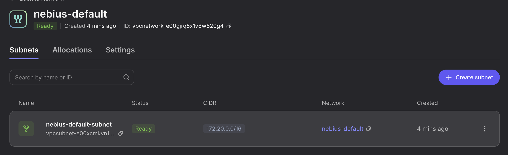
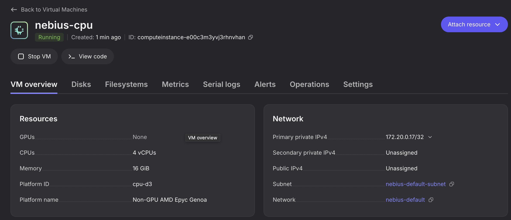
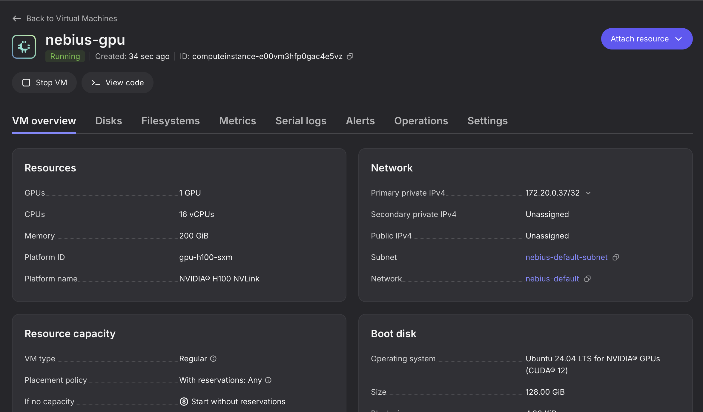

# Nebius Cloud Integration

## Overview

This guide walks through joining nodes from Nebius cloud to an existing AKS Flex cluster. By the end you will have:

- A Nebius VPC network peered with the Azure-side network
- A CPU node running in Nebius, joined to the AKS cluster
- A GPU node running in Nebius, joined to the AKS cluster

The workflow uses two CLI command groups:

- `aks-flex-cli config` -- generates JSON configuration templates for Nebius resources
- `aks-flex-cli plugin` -- applies, queries, and deletes Nebius resources via the flex-plugin backend

## Setup

### Prerequisites

- An AKS cluster with network resources already deployed -- see [AKS Cluster Setup](cli-prepare-aks-cluster.md)
- The `.env` file must include Nebius configuration (generate with `aks-flex-cli config env --nebius`):

```bash
# Nebius Config
export NEBIUS_PROJECT_ID=<your-nebius-project-id>
export NEBIUS_REGION=<your-nebius-region>
export NEBIUS_CREDENTIALS_FILE=<path-to-nebius-credentials-json>
```

See the [Nebius authorized keys documentation](https://docs.nebius.com/iam/service-accounts/authorized-keys) for creating the credentials file.

### Desired Cluster Setup

We will join two Nebius nodes to the AKS cluster:

| Node       | Platform   | Preset       | Image Family                | Purpose                     |
| ---------- | ---------- | ------------ | --------------------------- | --------------------------- |
| CPU node   | `cpu-d3`   | `4vcpu-16gb` | `ubuntu24.04-driverless`    | General-purpose workloads   |
| GPU node   | `gpu-h100-sxm` | `1gpu-16vcpu-200gb` | `ubuntu24.04-cuda12`  | GPU-accelerated workloads   |

## Create Nebius Network Resources

Before creating nodes, you need to provision a VPC network in Nebius that will be connected to the Azure-side network.

### Generate the network config

Use `config networks` to generate a default Nebius network JSON template:

```bash
$ aks-flex-cli config networks nebius > nebius-network.json
```

This produces a JSON file like:

```json
{
  "metadata": {
    "type": "networks.nebius.network.Network",
    "id": "<replace-with-unique-network-name>"
  },
  "spec": {
    "projectId": "<your-nebius-project-id>",
    "region": "<your-nebius-region>",
    "vnet": {
      "cidrBlock": "172.20.0.0/16"
    }
  }
}
```

Review the generated file and update the placeholder values:

| Field              | Description                              | Default            |
| ------------------ | ---------------------------------------- | ------------------ |
| `metadata.id`      | Name of the network resource, should be unique within the Nebius project | `nebius-default` (replace with your own) |
| `spec.projectId`   | Nebius project ID                        | from `.env`        |
| `spec.region`      | Nebius region                            | from `.env`        |
| `spec.vnet.cidrBlock` | CIDR block for the Nebius VPC         | `172.20.0.0/16`    |

### Apply the network config

Pipe the JSON into the `plugin apply` command:

```bash
$ cat nebius-network.json | aks-flex-cli plugin apply networks
```

Expected output:

```
2026/02/21 20:07:00 Applied "nebius-default" (type: networks.nebius.network.Network)
```

### Verify the network

```bash
$ aks-flex-cli plugin get networks nebius-default
```

```json
{
  "metadata": {
    "type": "type.googleapis.com/networks.nebius.network.Network",
    "id": "<your-network-name>"
  },
  "spec": {
    "projectId": "<your-nebius-project-id>",
    "region": "<your-nebius-region>",
    "vnet": {
      "cidrBlock": "172.20.0.0/16"
    }
  },
  "status": {
    ...
  }
}
```



## Nebius - Azure Network Connectivity

AKS Flex uses WireGuard to establish an encrypted site-to-site tunnel between the Azure VNet and the Nebius VPC. On top of this tunnel, Cilium's VXLAN overlay is used to extend the Kubernetes pod network across clouds so that pods on Azure and Nebius nodes can communicate seamlessly.

The following diagram illustrates the connectivity:

```
                  Azure                                             Nebius
  ┌──────────────────────────────┐             ┌──────────────────────────────┐
  │  VNet: 172.16.0.0/16         │             │  VPC: 172.20.0.0/16          │
  │                              │             │                              │
  │  ┌────────────┐              │  WireGuard  │              ┌────────────┐  │
  │  │ AKS Node   │              │  Tunnel     │              │ Nebius VM  │  │
  │  │            │              │◄───────────►│              │            │  │
  │  └────────────┘              │  (UDP/51820)│              └────────────┘  │
  │                              │             │                              │
  │  ┌────────────┐              │             │              ┌────────────┐  │
  │  │ WireGuard  │──────────────┼─────────────┼──────────────│ WireGuard  │  │
  │  │ Gateway    │  Peer IP: 100.96.x.x       │              │ Peer       │  │
  │  └────────────┘              │             │              └────────────┘  │
  │                              │             │                              │
  │         Cilium VXLAN overlay spans across both clouds                     │
  └──────────────────────────────┘             └──────────────────────────────┘
```

### Peer IP assignment

Each node that participates in the WireGuard mesh is assigned a **peer IP** from the `100.96.0.0/12` range. This peer IP is critical because it serves as the node's address within the WireGuard tunnel and must be set as the node's InternalIP in Kubernetes. This allows `kube-proxy` to correctly forward service traffic to the node, since kube-proxy routes based on the node's InternalIP.

When configuring agent pools, each node must be assigned a unique peer IP from this range. For example:

| Node         | Peer IP         |
| ------------ | --------------- |
| CPU node     | `100.96.1.111`  |
| GPU node     | `100.96.1.112`  |

## Create Nebius CPU Node

### Generate the agent pool config

Use `config agentpools` to generate a default Nebius agent pool JSON template:

```bash
$ aks-flex-cli config agentpools nebius > nebius-cpu.json
```

This produces a JSON file like:

```json
{
  "metadata": {
    "type": "agentpools.nebius.instance.AgentPool",
    "id": "nebius-default"
  },
  "spec": {
    "projectId": "<your-nebius-project-id>",
    "region": "<your-nebius-region>",
    "subnetId": "<replace-with-actual-value>",
    "platform": "<replace-with-actual-value>",
    "preset": "<replace-with-actual-value>",
    "imageFamily": "<replace-with-actual-value>",
    "osDiskSizeGibibytes": "128",
    "kubeadm": {
      "server": "https://<aks-cluster-fqdn>:443",
      "certificateAuthorityData": "<base64-ca-cert>",
      "token": "<bootstrap-token>",
      "nodeLabels": {
        "aks.azure.com/stretch-managed": "true",
        ...
      }
    },
    "wireguard": {
      "peerIp": "<replace-with-actual-value>"
    }
  }
}
```

Edit the file to configure a CPU node. Update the placeholder fields:

| Field               | Value for CPU node              | Description                                          |
| ------------------- | ------------------------------- | ---------------------------------------------------- |
| `metadata.id`       | `nebius-cpu`                    | Unique name for this agent pool                      |
| `spec.subnetId`     | *(from Nebius network output)*  | Subnet ID from the network created in the previous step |
| `spec.platform`     | `cpu-d3`                        | Nebius compute platform                              |
| `spec.preset`       | `4vcpu-16gb`                    | VM size preset <!-- TODO: add link to Nebius docs listing available platform/preset values --> |
| `spec.imageFamily`  | `ubuntu24.04-driverless`        | OS image family                                      |
| `spec.wireguard.peerIp` | *(unique IP in `100.96.0.0/12`)* | WireGuard peer IP for this node (see [Peer IP assignment](#peer-ip-assignment)) |

The `kubeadm` section is auto-populated from the running AKS cluster when the `.env` is configured correctly. If the cluster is not reachable, placeholder values are generated that must be replaced manually.

### Apply the agent pool config

```bash
$ cat nebius-cpu.json | aks-flex-cli plugin apply agentpools
```

Expected output:

```
2026/02/21 20:10:24 Applied "nebius-cpu" (type: agentpools.nebius.instance.AgentPool)
```

### Verify the node joined the cluster

After the node provisions and bootstraps (this may take a few minutes), verify it appears in the AKS cluster:

```bash
$ aks-flex-cli plugin get agentpools nebius-cpu
```

```bash
$ export KUBECONFIG=./aks.kubeconfig
$ kubectl get nodes -o wide
k get node -o wide
NAME                                 STATUS     ROLES    AGE   VERSION   INTERNAL-IP    EXTERNAL-IP   OS-IMAGE             KERNEL-VERSION       CONTAINER-RUNTIME
aks-system-32742974-vmss000000       Ready      <none>   40m   v1.33.6   172.16.1.4     <none>        Ubuntu 22.04.5 LTS   5.15.0-1102-azure    containerd://1.7.30-1
aks-system-32742974-vmss000001       Ready      <none>   40m   v1.33.6   172.16.1.5     <none>        Ubuntu 22.04.5 LTS   5.15.0-1102-azure    containerd://1.7.30-1
aks-wireguard-12237243-vmss000000    Ready      <none>   21m   v1.33.6   172.16.2.4     <MASKED>      Ubuntu 22.04.5 LTS   5.15.0-1102-azure    containerd://1.7.30-1
computeinstance-e00c3m3yvj3rhnvhan   Ready      <none>   58s   v1.33.8   100.96.1.111   <none>        Ubuntu 24.04.4 LTS   6.11.0-1016-nvidia   containerd://1.7.28
```



## Create Nebius GPU Node

The process is the same as for the CPU node, but with GPU-specific platform and image settings.

### Generate and edit the agent pool config

```bash
$ aks-flex-cli config agentpools nebius > nebius-gpu.json
```

Edit the file to configure a GPU node:

| Field               | Value for GPU node              | Description                                          |
| ------------------- | ------------------------------- | ---------------------------------------------------- |
| `metadata.id`       | `nebius-gpu`                    | Unique name for this agent pool                      |
| `spec.subnetId`     | *(from Nebius network output)*  | Same subnet as the CPU node                          |
| `spec.platform`     | *(GPU platform, e.g. `gpu-h100-sxm`)* | Nebius GPU compute platform                   |
| `spec.preset`       | *(GPU preset, e.g. `1gpu-16vcpu-200gb`)* | GPU VM size preset <!-- TODO: add link to Nebius docs listing available platform/preset values --> |
| `spec.imageFamily`  | *(GPU image, e.g. `ubuntu24.04-cuda12`)* | OS image with GPU drivers                   |
| `spec.wireguard.peerIp` | *(unique IP in `100.96.0.0/12`)* | WireGuard peer IP (must differ from CPU node, see [Peer IP assignment](#peer-ip-assignment)) |

### Apply the agent pool config

```bash
$ cat nebius-gpu.json | aks-flex-cli plugin apply agentpools
```

Expected output:

```
2026/02/21 20:16:36 Applied "nebius-gpu" (type: agentpools.nebius.instance.AgentPool)
```

### Verify the node joined the cluster

```bash
$ aks-flex-cli plugin get agentpools nebius-gpu
```

```bash
$ kubectl get nodes -o wide
k get node -o wide
NAME                                 STATUS   ROLES    AGE     VERSION   INTERNAL-IP    EXTERNAL-IP   OS-IMAGE             KERNEL-VERSION       CONTAINER-RUNTIME
aks-system-32742974-vmss000000       Ready    <none>   50m     v1.33.6   172.16.1.4     <none>        Ubuntu 22.04.5 LTS   5.15.0-1102-azure    containerd://1.7.30-1
aks-system-32742974-vmss000001       Ready    <none>   50m     v1.33.6   172.16.1.5     <none>        Ubuntu 22.04.5 LTS   5.15.0-1102-azure    containerd://1.7.30-1
aks-wireguard-12237243-vmss000000    Ready    <none>   31m     v1.33.6   172.16.2.4     <MASKED>      Ubuntu 22.04.5 LTS   5.15.0-1102-azure    containerd://1.7.30-1
computeinstance-e00c3m3yvj3rhnvhan   Ready    <none>   9m57s   v1.33.8   100.96.1.111   <none>        Ubuntu 24.04.4 LTS   6.11.0-1016-nvidia   containerd://1.7.28
computeinstance-e00vm3hfp0gac4e5vz   Ready    <none>   117s    v1.33.8   100.96.1.112   <none>        Ubuntu 24.04.4 LTS   6.11.0-1016-nvidia   containerd://1.7.28
```



## Validating cross-cloud connectivity

With the WireGuard tunnel and Cilium VXLAN overlay in place, pods running on the Nebius nodes should be able to
communicate with pods on the AKS nodes, and vice versa. We can validate this by checking the logs
from pods running on the Nebius nodes:

```
$ export GPU_NODE_NAME="computeinstance-e00vm3hfp0gac4e5vz"
$ kubectl -n kube-system logs -f $(kubectl -n kube-system get pod --field-selector spec.nodeName=$GPU_NODE_NAME -l component=kube-proxy -o jsonpath='{.items[*].metadata.name}')
Defaulted container "kube-proxy" out of: kube-proxy, kube-proxy-bootstrap (init)
I0222 04:20:45.184240       1 server_linux.go:63] "Using iptables proxy"
I0222 04:20:45.184345       1 flags.go:64] FLAG: --bind-address="0.0.0.0"
I0222 04:20:45.184351       1 flags.go:64] FLAG: --bind-address-hard-fail="false"
I0222 04:20:45.184355       1 flags.go:64] FLAG: --boot-id-file="/proc/sys/kernel/random/boot_id"
I0222 04:20:45.184357       1 flags.go:64] FLAG: --cleanup="false"
I0222 04:20:45.184359       1 flags.go:64] FLAG: --cluster-cidr="10.244.0.0/16"
```

### GPU Device Plugin

> **TODO:** GPU workloads require a device plugin to expose GPU resources to the Kubernetes scheduler.
> Currently this must be installed manually. Document the steps for installing the NVIDIA device
> plugin (or GPU operator) on the Nebius GPU node once the process is finalized.

## Clean up resources

To remove the Nebius nodes and network, delete them in reverse order: agent pools first, then the network.

### Delete agent pools

```bash
$ aks-flex-cli plugin delete agentpools nebius-gpu
$ aks-flex-cli plugin delete agentpools nebius-cpu
```

Expected output:

```
...
2026/02/21 20:29:19 Deleting "nebius-cpu"...
2026/02/21 20:30:47 Successfully deleted "nebius-cpu"
```

Verify the nodes are showing as NotReady in Kubernetes, indicating the kubelet has been stopped.

```bash
$ kubectl get nodes
NAME                                 STATUS     ROLES    AGE   VERSION
aks-system-32742974-vmss000000       Ready      <none>   58m   v1.33.6
aks-system-32742974-vmss000001       Ready      <none>   58m   v1.33.6
aks-wireguard-12237243-vmss000000    Ready      <none>   39m   v1.33.6
computeinstance-e00c3m3yvj3rhnvhan   NotReady   <none>   18m   v1.33.8
computeinstance-e00vm3hfp0gac4e5vz   NotReady   <none>   10m   v1.33.8
```

### Delete the network

```bash
$ aks-flex-cli plugin delete networks nebius-default
```

Expected output:

```
2026/02/21 20:31:35 Deleting "nebius-default"...
2026/02/21 20:31:37 Successfully deleted "nebius-default"
```

### List remaining resources

Confirm all Nebius resources are cleaned up:

```bash
$ aks-flex-cli plugin get networks
[]
$ aks-flex-cli plugin get agentpools
[]
```

Both commands should return empty lists.