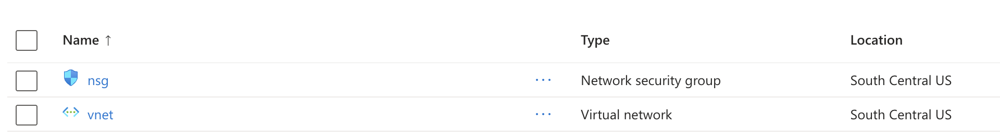
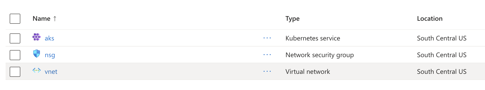

# AKS Cluster Setup

## Overview

This guide walks through preparing a base AKS cluster and the supporting Azure resources needed for AKS Flex. By the end of this guide you will have:

- A resource group with the required Azure network infrastructure (VNet, subnets, NSG)
- An AKS managed cluster with BYO (Bring Your Own) Cilium CNI enabled
- A downloaded kubeconfig for connecting to the cluster

Optionally, you can also deploy:

- **Unbounded CNI** for cross-cloud networking via the Unbounded CNI operator -- see [Enable with Unbounded CNI](#enable-with-unbounded-cni)

## Setup

### CLI

Install the `aks-flex-cli` binary and generate a `.env` configuration file by following the instructions in [CLI Setup](cli-setup.md).

### Configuration

Ensure your `.env` file in the `cli/` directory contains the required Azure settings. A minimal configuration looks like:

```bash
# Azure Config
export LOCATION=southcentralus
export AZURE_SUBSCRIPTION_ID=<your-subscription-id>
export RESOURCE_GROUP_NAME=rg-aks-flex-<username>
```

The following environment variables are relevant to cluster creation:

| Variable                 | Description                            | Default              |
| ------------------------ | -------------------------------------- | -------------------- |
| `LOCATION`               | Azure region for all resources         | (required)           |
| `AZURE_SUBSCRIPTION_ID`  | Azure subscription ID                  | auto-detected        |
| `RESOURCE_GROUP_NAME`    | Resource group name                    | `$USER`              |
| `CLUSTER_NAME`           | Name of the AKS cluster                | `flex`               |
| `CLUSTER_VERSION`        | Kubernetes version for the AKS cluster | `1.34.2`             |
| `SYSTEM_VM_SIZE`         | VM size for the system node pool       | `Standard_D8ds_v5`   |
| `GATEWAY_VM_SIZE`        | VM size for the gateway node           | `Standard_D16ds_v5`  |

### Desired Cluster Setup

The CLI creates an AKS cluster with `networkPlugin: none`, which disables the built-in Azure CNI so that Cilium can be installed as the cluster's CNI instead. The cluster is deployed with:

- A **system** node pool (3 nodes) in the `aks` subnet (`172.16.1.0/24`)
- **Cilium CNI** installed via the Cilium CLI after the cluster is provisioned
- A system-assigned managed identity

If you need site-to-site connectivity without a VPN gateway (or for development/testing purposes), you can additionally enable Unbounded CNI -- refer to the [Enable with Unbounded CNI](#enable-with-unbounded-cni) section below.

## Create Network Resources

First, deploy the Azure network infrastructure. This creates a resource group (if it does not exist) and provisions:

| Resource                | Name   | Details                          |
| ----------------------- | ------ | -------------------------------- |
| Network Security Group  | `nsg`  | Baseline inbound security rules  |
| Virtual Network         | `vnet` | Address space `172.16.0.0/16`    |
| Subnet -- GatewaySubnet | `GatewaySubnet` | `172.16.0.0/24` (reserved for VPN gateway) |
| Subnet -- AKS           | `aks`  | `172.16.1.0/24` (system node pool) |
| Subnet -- Nodes         | `nodes`| `172.16.2.0/24` (additional node pools) |

Run the network deploy command:

```bash
$ aks-flex-cli network deploy
```

Expected output:

```
2026/02/21 19:26:04 network deployment complete
```

To also deploy a VPN gateway (for production site-to-site VPN), add the `--gateway` flag:

```bash
$ aks-flex-cli network deploy --gateway
```

> **Note:** VPN gateway provisioning can take 20-40 minutes.



## Create AKS Cluster

With the network in place, deploy the AKS cluster with Cilium enabled:

```bash
$ aks-flex-cli aks deploy --cilium
```

This command performs the following steps:

1. Deploys the AKS cluster via an ARM template into the existing VNet
2. Downloads the cluster kubeconfig and merges it into `~/.kube/config` (created if it does not exist), setting the cluster as the current context
3. Applies baseline Kubernetes resources
4. Installs Cilium CNI using the `cilium install` CLI

Expected output:

```
2026/02/21 19:43:58 Deploying AKS cluster "aks" in "rg-aks-flex-<username>"
2026/02/21 19:46:34 AKS cluster deployment complete
2026/02/21 19:46:35 kubeconfig saved to "/home/<username>/.kube/config"
2026/02/21 19:46:38 Kubernetes-side deployment complete
🔮 Auto-detected Kubernetes kind: AKS
ℹ️  Using Cilium version 1.18.5
🔮 Auto-detected cluster name: aks
...
🔮 Auto-detected kube-proxy has been installed
2026/02/21 19:46:45 Cilium deployment complete
```

To write the kubeconfig to a different path instead, use `--kubeconfig` (merge-or-create behavior applies to that path as well):

```bash
$ aks-flex-cli aks deploy --cilium --kubeconfig ./my-cluster.kubeconfig
```



### Enable with Unbounded CNI

Unbounded CNI provides cross-cloud networking through the Unbounded CNI operator, which manages Site, GatewayPool, and SiteGatewayPoolAssignment resources to route traffic between clouds.

> **Note:** The `--unbounded-cni` flag is mutually exclusive with `--cilium`.

To deploy the cluster with Unbounded CNI:

```bash
$ aks-flex-cli aks deploy --unbounded-cni
```

In addition to the standard AKS resources, the `--unbounded-cni` flag provisions:

| Resource                 | Name                    | Details                                          |
| ------------------------ | ----------------------- | ------------------------------------------------ |
| NSG rule                 | `AllowGateway`          | Allows inbound UDP/51820-51999                   |
| Public IP prefix         | `gw-pips`               | Static public IP prefix for the gateway node     |
| Agent pool               | `gateway`               | 1-node pool in the `nodes` subnet with public IP (size: `$GATEWAY_VM_SIZE`) |

After the ARM deployment, the CLI automatically:

1. Installs the Unbounded CNI operator (CRDs, controller, node agents) via `kubectl apply -k`
2. Applies the Azure-side resources: Site, GatewayPool, and SiteGatewayPoolAssignment via `kubectl apply -f`

Expected output:

```
2026/03/03 10:05:00 Deploying AKS cluster "aks" in "rg-aks-flex-<username>"
2026/03/03 10:15:00 AKS cluster deployment complete
2026/03/03 10:15:01 kubeconfig saved to "/home/<username>/.kube/config"
2026/03/03 10:15:03 Kubernetes-side deployment complete
namespace/unbounded-cni created
customresourcedefinition.apiextensions.k8s.io/gatewaypoolnodes.unbounded.aks.azure.com created
customresourcedefinition.apiextensions.k8s.io/gatewaypoolpeerings.unbounded.aks.azure.com created
customresourcedefinition.apiextensions.k8s.io/gatewaypools.unbounded.aks.azure.com created
customresourcedefinition.apiextensions.k8s.io/sitegatewaypoolassignments.unbounded.aks.azure.com created
customresourcedefinition.apiextensions.k8s.io/sitenodeslices.unbounded.aks.azure.com created
customresourcedefinition.apiextensions.k8s.io/sitepeerings.unbounded.aks.azure.com created
customresourcedefinition.apiextensions.k8s.io/sites.unbounded.aks.azure.com created
serviceaccount/unbounded-cni-controller created
serviceaccount/unbounded-cni-node created
role.rbac.authorization.k8s.io/unbounded-cni-controller created
clusterrole.rbac.authorization.k8s.io/unbounded-cni-controller created
clusterrole.rbac.authorization.k8s.io/unbounded-cni-node created
rolebinding.rbac.authorization.k8s.io/unbounded-cni-controller created
clusterrolebinding.rbac.authorization.k8s.io/unbounded-cni-controller created
clusterrolebinding.rbac.authorization.k8s.io/unbounded-cni-node created
configmap/unbounded-cni-config created
configmap/unbounded-cni-frr-config created
service/unbounded-cni-controller created
service/unbounded-cni-webhook created
deployment.apps/unbounded-cni-controller configured
daemonset.apps/unbounded-cni-node created
gatewaypool.unbounded.aks.azure.com/main-gateways created
site.unbounded.aks.azure.com/site-azure created
sitegatewaypoolassignment.unbounded.aks.azure.com/main-gateway-site-azure created
2026/03/03 19:53:10 Unbounded CNI deployment complete
```

## Connecting to the cluster

After the AKS cluster is created, the CLI merges the kubeconfig into `~/.kube/config` and sets the cluster as the current context. You can connect immediately without any extra steps:

```bash
$ kubectl get nodes
NAME                             STATUS   ROLES    AGE   VERSION
aks-system-32742974-vmss000000   Ready    <none>   16m   v1.33.6
aks-system-32742974-vmss000001   Ready    <none>   16m   v1.33.6
```

If you deployed with `--unbounded-cni`, you will see the gateway node pool:

```bash
$ kubectl get nodes
NAME                                STATUS   ROLES    AGE     VERSION
aks-gateway-26665104-vmss000000     Ready    <none>   3h27m   v1.34.2
aks-system-14211521-vmss000000      Ready    <none>   3h31m   v1.34.2
aks-system-14211521-vmss000001      Ready    <none>   3h31m   v1.34.2
aks-system-14211521-vmss000002      Ready    <none>   3h31m   v1.34.2
```
