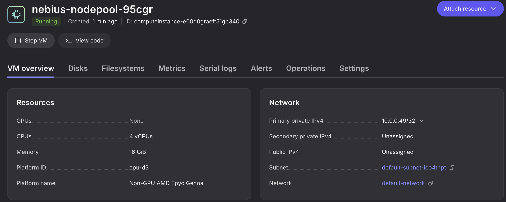
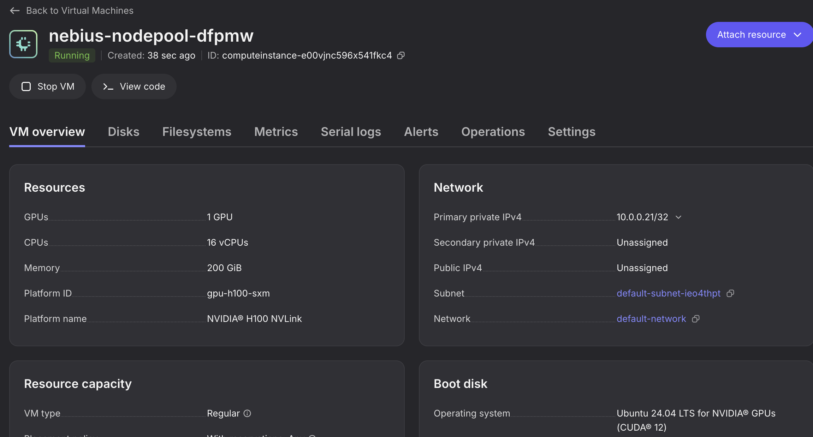
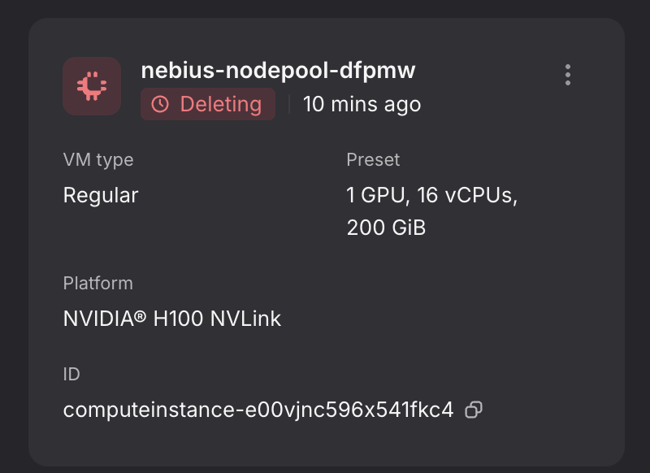

# Karpenter Provider Flex

## Overview

This guide walks through deploying `karpenter` to an AKS Flex cluster and using Karpenter to automatically provision and deprovision cloud nodes. By the end you will have:

- The karpenter controller running in the cluster
- `NodeClass` and `NodePool` resources configured for Azure and/or Nebius compute instances
- Workloads that trigger automatic node scale-up
- An understanding of how to scale down and clean up provisioned nodes

Karpenter watches for unschedulable pods and automatically provisions new nodes to meet demand. The `karpenter` extends Karpenter with multiple cloud providers:

- **Azure** (`AKSNodeClass`) — provisions Azure VMs directly into the cluster's node resource group, joining the existing AKS cluster.
- **Nebius** (`NebiusNodeClass`) — provisions Nebius VMs that join the AKS cluster as worker nodes over WireGuard.

## Getting Started

### Prerequisites

- **AKS Flex CLI** -- installed and configured with a `.env` file. See [CLI Setup](cli-setup.md).
- **AKS cluster** -- an AKS cluster provisioned via the CLI. For Nebius nodes, the cluster must also have WireGuard enabled for cross-cloud connectivity. See [AKS Cluster Setup](cli-prepare-aks-cluster.md).
- **Nebius service account credentials** *(Nebius only)* -- a Nebius credentials JSON file for the karpenter controller. See the [Nebius authorized keys documentation](https://docs.nebius.com/iam/service-accounts/authorized-keys).
- **Helm** -- required for installing the karpenter chart.

### Configuration

Ensure your `.env` file contains the standard Azure settings:

```bash
export LOCATION=southcentralus
export AZURE_SUBSCRIPTION_ID=<your-subscription-id>
export RESOURCE_GROUP_NAME=rg-aks-flex-<username>
export CLUSTER_NAME=aks
```

The CLI resolves all Helm chart values from these environment variables and the live AKS cluster. No additional Karpenter-specific environment variables are required.

## Installing the Provider via Helm

### 1. Create the karpenter namespace

```bash
$ kubectl create namespace karpenter
```

### 2. Upload Nebius credentials

The karpenter controller needs Nebius API credentials to provision VMs. Upload your credentials file as a Kubernetes secret using the provided helper script:

```bash
$ ./karpenter/hack/upload-nebius-credentials.sh <path-to-credentials-json>
```

This creates a secret named `nebius-credentials` in the `karpenter` namespace with the credentials file stored under the key `credentials.json`.

| Argument                      | Description                              | Default              |
| ----------------------------- | ---------------------------------------- | -------------------- |
| `path-to-credentials-file`    | Local path to the Nebius credentials JSON | *(required)*         |
| `namespace` *(optional)*      | Target Kubernetes namespace              | `karpenter`          |
| `secret-name` *(optional)*    | Name of the created Secret               | `nebius-credentials` |

### 3. Azure permissions for the karpenter identity

The AKS ARM template (`aks-flex-cli aks deploy`) automatically provisions a user-assigned managed identity named `karpenter-flex` and assigns the following roles:

| Role | Scope | Purpose |
| ---- | ----- | ------- |
| **Network Contributor** | Resource group | VNET GUID resolution at startup, subnet join when creating NICs |
| **Virtual Machine Contributor** | Node resource group | VM lifecycle — create and delete Azure VMs |
| **Network Contributor** | Node resource group | NIC lifecycle — create and delete NICs for provisioned VMs |
| **Managed Identity Operator** | Node resource group | Assign managed identities to provisioned VMs |

The template also creates a **federated identity credential** that pairs the managed identity with the AKS cluster's OIDC issuer, granting access to the `karpenter` service account in the `karpenter` namespace. This enables workload identity — no manual role assignment steps are required.

### 4. Generate and run the Helm install command

Use the CLI to generate a `helm upgrade --install` command with all required values pre-populated:

```bash
$ aks-flex-cli config karpenter helm
```

Expected output:

```
helm upgrade --install karpenter charts/karpenter \
  --namespace karpenter \
  --create-namespace \
  --set settings.clusterName="aks" \
  --set settings.clusterEndpoint="https://aks-xxxx.hcp.eastus2.azmk8s.io:443" \
  --set logLevel=debug \
  --set replicas=1 \
  --set controller.nebiusCredentials.enabled=true \
  --set controller.image.digest="" \
  --set "serviceAccount.annotations.azure\.workload\.identity/client-id=<karpenter-flex-client-id>" \
  --set-string "podLabels.azure\.workload\.identity/use=true" \
  --set "controller.env[0].name=ARM_CLOUD,controller.env[0].value=AzurePublicCloud" \
  --set "controller.env[1].name=LOCATION,controller.env[1].value=southcentralus" \
  --set "controller.env[2].name=ARM_RESOURCE_GROUP,controller.env[2].value=rg-aks-flex-<username>" \
  --set "controller.env[3].name=AZURE_TENANT_ID,controller.env[3].value=<tenant-id>" \
  --set "controller.env[4].name=AZURE_CLIENT_ID,controller.env[4].value=<karpenter-flex-client-id>" \
  --set "controller.env[5].name=AZURE_SUBSCRIPTION_ID,controller.env[5].value=<subscription-id>" \
  --set "controller.env[6].name=AZURE_NODE_RESOURCE_GROUP,controller.env[6].value=<node-resource-group>" \
  --set "controller.env[7].name=SSH_PUBLIC_KEY,controller.env[7].value=ssh-ed25519 AAAA..." \
  --set "controller.env[8].name=VNET_SUBNET_ID,controller.env[8].value=/subscriptions/.../subnets/aks" \
  --set "controller.env[9].name=KUBELET_BOOTSTRAP_TOKEN,controller.env[9].value=<token-id>.<token-secret>" \
  --set-string "controller.env[10].name=DISABLE_LEADER_ELECTION,controller.env[10].value=false"
```

If any value cannot be resolved (e.g. the cluster is not reachable), it is replaced with `<replace-with-actual-value>`. Edit these placeholders before running the command.

Copy the output and run it from the `karpenter/` directory:

```bash
$ helm upgrade --install karpenter charts/karpenter \
  --namespace karpenter \
  ...
```

#### Overriding the controller image

To use a custom controller image instead of the chart default, pass the `--image` flag:

```bash
$ aks-flex-cli config karpenter helm --image myregistry.io/karpenter:v0.2.0
```

This adds `--set controller.image.repository=myregistry.io/karpenter` and `--set controller.image.tag=v0.2.0` to the generated command.

### 5. Verify the controller is running

```bash
$ kubectl -n karpenter get pods
NAME                         READY   STATUS    RESTARTS      AGE
karpenter-6b55df659d-m2d5g   1/1     Running   7 (13m ago)   20m
```

## Creating Nodes on Azure via Karpenter

With the karpenter controller running, you can define an `AKSNodeClass` and `NodePool` to provision Azure VMs directly into the cluster's node resource group.

### Creating an AKSNodeClass

The `AKSNodeClass` defines the Azure-specific configuration for provisioned nodes:

```bash
$ kubectl apply -f examples/azure/nodeclass.yaml
```

Verify the node class is ready:

```bash
$ kubectl get aksnodeclass
NAME    READY   AGE
azure   True    5s
```

### Creating a CPU NodePool

```bash
$ kubectl apply -f examples/azure/cpu_nodepool.yaml
```

Verify the node pool is ready:

```bash
$ kubectl get nodepool
NAME                 NODECLASS   NODES   READY   AGE
azure-cpu-nodepool   azure       0       True    4s
```

### Creating a GPU NodePool

For GPU workloads, create a NodePool that pins to a specific GPU SKU via `node.kubernetes.io/instance-type`:

```bash
$ kubectl apply -f examples/azure/gpu_nodepool.yaml
```

Both node pools should now be ready:

```bash
$ kubectl get nodepool
NAME                 NODECLASS   NODES   READY   AGE
azure-cpu-nodepool   azure       0       True    4s
azure-gpu-nodepool   azure       0       True    2s
```

### Deploy a workload to trigger scale-up

```bash
$ kubectl apply -f examples/azure/cpu_deployment.yaml
```

Karpenter detects the unschedulable pod and creates a `NodeClaim`:

```bash
$ kubectl get nodeclaims
NAME                       TYPE           CAPACITY   ZONE   NODE                         READY   AGE
azure-cpu-nodepool-6rhlk                                    aks-azure-cpu-nodepool-6rhlk True    2m
```

> **Note:** GPU workloads require the NVIDIA device plugin. Install it with the CLI before creating GPU workloads:
>
> ```bash
> aks-flex-cli aks deploy --gpu-device-plugin --skip-arm
> ```

## Creating Nodes on Nebius via Karpenter

With the karpenter controller running, you can define a `NebiusNodeClass` and `NodePool` to tell Karpenter how and when to provision Nebius nodes.

### Creating a NebiusNodeClass

The `NebiusNodeClass` defines the Nebius-specific configuration for provisioned nodes:

```bash
$ kubectl apply -f examples/nebius/nodeclass.yaml
```

Verify the node class is ready:

```bash
$ kubectl get nebiusnodeclass
NAME     READY   AGE
nebius   True    3s
```

### Creating a NodePool

The `NodePool` defines scheduling constraints and references the `NebiusNodeClass`:

```bash
$ kubectl apply -f examples/nebius/cpu_nodepool.yaml
```

Verify the node pool is ready:

```bash
$ kubectl get nodepool
NAME                  NODECLASS   NODES   READY   AGE
nebius-cpu-nodepool   nebius      0       True    4s
```

### Creating a GPU NodePool

For GPU workloads, create a separate NodePool that does not restrict by CPU SKU. The `karpenter.azure.com/sku-cpu` label is not present on GPU instance types, so the CPU NodePool's `Gt` requirement would prevent GPU instances from ever being selected. The GPU NodePool omits that constraint and relies on the workload's node affinity (via `node.kubernetes.io/instance-type`) to select the appropriate GPU instance:

```bash
$ kubectl apply -f examples/nebius/gpu_nodepool.yaml
```

Both node pools should now be ready:

```bash
$ kubectl get nodepool
NAME                  NODECLASS   NODES   READY   AGE
nebius-cpu-nodepool   nebius      0       True    4s
nebius-gpu-nodepool   nebius      0       True    2s
```

### Deploy a workload to trigger scale-up

Create a deployment that schedules pods away from system nodes. Karpenter will detect the unschedulable pods and provision a new Nebius node:

```bash
$ kubectl apply -f examples/nebius/cpu_deployment.yaml
```

The pod will initially be in `Pending` state while Karpenter provisions a new node:

```bash
$ kubectl get pods
NAME                             READY   STATUS    RESTARTS   AGE
sample-cpu-app-6c7bb4ccb-wbl5h   1/1     Running   0          9m51s
```

Karpenter creates a `NodeClaim` to request a new node from Nebius:

```bash
$ kubectl get nodeclaims
NAME                        TYPE                 CAPACITY    ZONE   NODE                                 READY   AGE
nebius-cpu-nodepool-6g8v8   cpu-d3-16vcpu-64gb   on-demand   1      computeinstance-e00a4p0rrnms9n24jp   True    9m35s
```

After a few minutes, the new Nebius node should appear:

```bash
$ kubectl get nodes -o wide
NAME                                 STATUS   ROLES    AGE     VERSION   INTERNAL-IP    EXTERNAL-IP     OS-IMAGE             KERNEL-VERSION       CONTAINER-RUNTIME
aks-system-94214615-vmss000000       Ready    <none>   3h13m   v1.34.2   172.16.1.4     <none>          Ubuntu 22.04.5 LTS   5.15.0-1102-azure    containerd://1.7.30-1
aks-system-94214615-vmss000001       Ready    <none>   3h13m   v1.34.2   172.16.1.5     <none>          Ubuntu 22.04.5 LTS   5.15.0-1102-azure    containerd://1.7.30-1
aks-system-94214615-vmss000002       Ready    <none>   3h13m   v1.34.2   172.16.1.6     <none>          Ubuntu 22.04.5 LTS   5.15.0-1102-azure    containerd://1.7.30-1
aks-wireguard-23306360-vmss000000    Ready    <none>   3h9m    v1.34.2   172.16.2.4     20.91.194.208   Ubuntu 22.04.5 LTS   5.15.0-1102-azure    containerd://1.7.30-1
computeinstance-e00a4p0rrnms9n24jp   Ready    <none>   8m30s   v1.33.3   100.96.1.237   <none>          Ubuntu 24.04.4 LTS   6.11.0-1016-nvidia   containerd://2.0.4
```

The pod is now running on the Nebius node:

```bash
$ kubectl get pod -o wide
NAME                             READY   STATUS    RESTARTS   AGE   IP            NODE                                 NOMINATED NODE   READINESS GATES
sample-cpu-app-6c7bb4ccb-wbl5h   1/1     Running   0          10m   10.0.10.159   computeinstance-e00a4p0rrnms9n24jp   <none>           <none>
```

```bash
$ kubectl logs -f sample-cpu-app-6c7bb4ccb-wbl5h
/docker-entrypoint.sh: /docker-entrypoint.d/ is not empty, will attempt to perform configuration
/docker-entrypoint.sh: Looking for shell scripts in /docker-entrypoint.d/
/docker-entrypoint.sh: Launching /docker-entrypoint.d/10-listen-on-ipv6-by-default.sh
10-listen-on-ipv6-by-default.sh: info: Getting the checksum of /etc/nginx/conf.d/default.conf
10-listen-on-ipv6-by-default.sh: info: Enabled listen on IPv6 in /etc/nginx/conf.d/default.conf
/docker-entrypoint.sh: Launching /docker-entrypoint.d/20-envsubst-on-templates.sh
/docker-entrypoint.sh: Launching /docker-entrypoint.d/30-tune-worker-processes.sh
/docker-entrypoint.sh: Configuration complete; ready for start up
2026/02/27 20:37:12 [notice] 1#1: using the "epoll" event method
2026/02/27 20:37:12 [notice] 1#1: nginx/1.21.6
2026/02/27 20:37:12 [notice] 1#1: built by gcc 10.2.1 20210110 (Debian 10.2.1-6) 
2026/02/27 20:37:12 [notice] 1#1: OS: Linux 6.11.0-1016-nvidia
2026/02/27 20:37:12 [notice] 1#1: getrlimit(RLIMIT_NOFILE): 1048576:1048576
```



### Deploy a GPU workload

For GPU workloads, create a deployment that requests GPU resources and targets GPU instance types:

```bash
$ kubectl apply -f examples/nebius/gpu_deployment.yaml
```

The GPU pod will be pending while Karpenter provisions a GPU node:

```bash
$ kubectl get pods
NAME                              READY   STATUS    RESTARTS   AGE
sample-cpu-app-6c7bb4ccb-wbl5h    1/1     Running   0          11m
sample-gpu-app-5d8b85c989-5l9zt   0/1     Pending   0          5s
```

Karpenter creates a new `NodeClaim` for the GPU instance:

```bash
$ kubectl get nodeclaims
NAME                        TYPE                               CAPACITY    ZONE   NODE                                 READY     AGE
nebius-cpu-nodepool-6g8v8   cpu-d3-16vcpu-64gb                 on-demand   1      computeinstance-e00a4p0rrnms9n24jp   True      11m
nebius-gpu-nodepool-r2qwq   gpu-h100-sxm-8gpu-128vcpu-1600gb   on-demand                                              Unknown   16s
```

> **Note:** GPU workloads require the NVIDIA device plugin to be installed so that `nvidia.com/gpu` resources are advertised to the scheduler. Install it with the CLI before creating GPU workloads:
>
> ```bash
> aks-flex-cli aks deploy --gpu-device-plugin --skip-arm
> ```

After the GPU node is provisioned, both nodes and pods should be running:

```bash
$ kubectl get nodes
NAME                                 STATUS   ROLES    AGE     VERSION
aks-system-94214615-vmss000000       Ready    <none>   3h19m   v1.34.2
aks-system-94214615-vmss000001       Ready    <none>   3h19m   v1.34.2
aks-system-94214615-vmss000002       Ready    <none>   3h18m   v1.34.2
aks-wireguard-23306360-vmss000000    Ready    <none>   3h14m   v1.34.2
computeinstance-e00a4p0rrnms9n24jp   Ready    <none>   13m     v1.33.3
computeinstance-e00zjdx1e50bxcfekk   Ready    <none>   107s    v1.33.3
```

```bash
$ kubectl get pods -o wide
NAME                              READY   STATUS    RESTARTS   AGE     IP            NODE                                 NOMINATED NODE   READINESS GATES
sample-cpu-app-6c7bb4ccb-7dg9t    1/1     Running   0          75s     10.0.12.199   computeinstance-e00zjdx1e50bxcfekk   <none>           <none>
sample-gpu-app-5d8b85c989-5l9zt   1/1     Running   0          4m17s   10.0.12.66    computeinstance-e00zjdx1e50bxcfekk   <none>           <none>
```

```bash
$ kubectl logs -f sample-gpu-app-76b4884cbd-m8bft
Sun Feb 22 22:05:49 2026
+-----------------------------------------------------------------------------------------+
| NVIDIA-SMI 570.195.03             Driver Version: 570.195.03     CUDA Version: 12.8     |
|-----------------------------------------+------------------------+----------------------+
| GPU  Name                 Persistence-M | Bus-Id          Disp.A | Volatile Uncorr. ECC |
| Fan  Temp   Perf          Pwr:Usage/Cap |           Memory-Usage | GPU-Util  Compute M. |
|                                         |                        |               MIG M. |
|=========================================+========================+======================|
|   0  NVIDIA H100 80GB HBM3          On  |   00000000:8D:00.0 Off |                    0 |
| N/A   28C    P0             68W /  700W |       0MiB /  81559MiB |      0%      Default |
|                                         |                        |             Disabled |
+-----------------------------------------+------------------------+----------------------+

+-----------------------------------------------------------------------------------------+
| Processes:                                                                              |
|  GPU   GI   CI              PID   Type   Process name                        GPU Memory |
|        ID   ID                                                               Usage      |
|=========================================================================================|
|  No running processes found                                                             |
+-----------------------------------------------------------------------------------------+
```



### Scale down nodes

When demand decreases, Karpenter automatically deprovisions nodes that are no longer needed. To test this, scale the deployments down:

```bash
$ kubectl scale deployment sample-cpu-app --replicas=0
$ kubectl scale deployment sample-gpu-app --replicas=0
```

You can observe the disruption lifecycle by describing a node claim:

```bash
$ kubectl describe nodeclaims nebius-nodepool-dfpmw
Events:
  Type    Reason                 Age                   From       Message
  ----    ------                 ----                  ----       -------
  Normal  Launched               9m15s                 karpenter  Status condition transitioned, Type: Launched, Status: Unknown -> True, Reason: Launched
  Normal  DisruptionBlocked      7m5s (x2 over 9m15s)  karpenter  Nodeclaim does not have an associated node
  Normal  Registered             5m30s                 karpenter  Status condition transitioned, Type: Registered, Status: Unknown -> True, Reason: Registered
  Normal  DisruptionBlocked      4m41s                 karpenter  Node isn't initialized
  Normal  Initialized            2m56s                 karpenter  Status condition transitioned, Type: Initialized, Status: Unknown -> True, Reason: Initialized
  Normal  Ready                  2m56s                 karpenter  Status condition transitioned, Type: Ready, Status: Unknown -> True, Reason: Ready
  Normal  DisruptionBlocked      2m35s                 karpenter  Node is nominated for a pending pod
  Normal  Unconsolidatable       111s                  karpenter  Not all pods would schedule, default/sample-gpu-app-76b4884cbd-m8bft => would schedule against uninitialized nodeclaim/nebius-nodepool-7g2rq default/sample-app-66986dd6c6-qs6gt => would schedule against uninitialized nodeclaim/nebius-nodepool-7g2rq
  Normal  DisruptionTerminating  19s                   karpenter  Disrupting NodeClaim: Underutilized
  Normal  DisruptionBlocked      19s                   karpenter  Node is deleting or marked for deletion
```

After the disruption grace period, Karpenter will terminate the idle Nebius nodes and they will be removed from the cluster:

```bash
$ kubectl get nodes
NAME                                 STATUS   ROLES    AGE    VERSION
aks-system-32742974-vmss000000       Ready    <none>   18h    v1.33.6
aks-system-32742974-vmss000001       Ready    <none>   18h    v1.33.6
aks-wireguard-12237243-vmss000000    Ready    <none>   18h    v1.33.6
```


